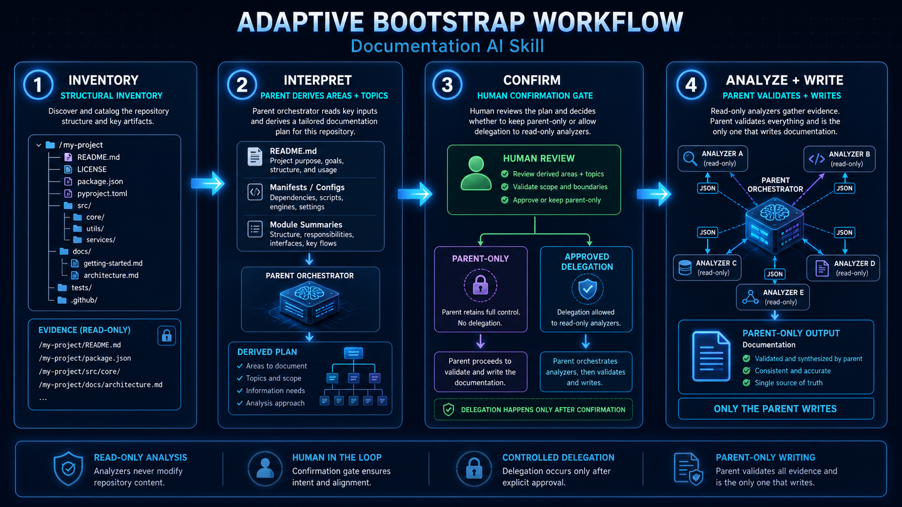

<h1 align="center">Codebase Analysis AI</h1>

<p align="center">
  Agentic AI codebase analysis for living documentation, architecture, and change-impact review.
</p>

<p align="center">
  
</p>

Are you tired of fragmented, inconsistent, unstructured, or even missing documentation?! Codebase Analysis AI keeps documentation aligned with the codebase through bounded, evidence-based analysis and repeatable checks.

It maps changed source files to the documentation they affect, reviews direct relationships, validates links and metadata, and asks an AI agent to update only what requires interpretation. `docs/index.md` is the canonical navigation entry point and is verified on every documentation change. During a full bootstrap, Python collects a bounded structural inventory; the parent agent reads the relevant project files, derives source macro-areas and documentation topics, then proposes one of three delegation strategies before writing the documentation.

Git, Python, Git hooks, and GitHub Actions provide the deterministic foundation; the agent skill handles evidence collection, orchestration, validation, and writing.

The result is a documentation system that helps a new developer understand the project's purpose, technologies, startup instructions, architecture, active functionality, known TODOs, and related flows immediately after cloning the repository.

> A provider-neutral Agent Skill for keeping code and documentation aligned. The visual assets in this README are illustrative; the text and examples remain the source of truth.

## Why use it

Codebase Analysis AI reduces documentation drift by:

- starting from Git changes instead of scanning the complete repository;
- mapping source files to directly affected documents;
- checking links, hashes, metadata, naming, and documentation coverage;
- reviewing bootstrap macro-areas through isolated, read-only subagents;
- preserving a consistent documentation structure and evidence-backed TODOs;
- supporting monoliths, full-stack applications, microservices, libraries, mobile applications, and infrastructure repositories.

## How it works

### Incremental updates

1. Git identifies changed or uncommitted source files.
2. A deterministic Python checker resolves source-to-document mappings and direct first-level relationships.
3. The agent reviews the impacted sources and documentation.
4. The agent updates stale content only when the evidence requires it.
5. The checker validates links and refreshed metadata.

The traversal stops after one relationship level. If source `A` maps to document `B`, and `B` links to `C`, the update checks `B` and `C` without traversing the rest of the documentation graph. SHA-256 hashes track processed source content even when changes are uncommitted, amended, or rebased.


### Full bootstrap orchestration

1. A deterministic inventory identifies structural evidence; the parent selectively reads it and derives source macro-areas and separate documentation topics without relying on a fixed technology catalog.
2. It proposes `parent-only`, mixed `selective`, or `all` safely separable areas, gives a brief evidence-based motivation and per-area assignment, and asks for confirmation before creating or invoking analyzers. During bootstrap, at least two independent macro-areas with 15 or more relevant files each require analyzer creation and delegation.
3. Approved analyzers review bounded source scopes and return JSON reports whose claims and findings include repository sources; small or overlapping areas may remain in the parent.
4. The parent validates paths and evidence, preserves and prioritizes findings, maps reports to thematic documents, resolves cross-area flows, and alone writes the documentation. The same findings contract applies when the parent works without analyzers.



Profiles are created only during `bootstrap`, and only for areas approved for delegation. Initial absence is handled according to the approved plan: when the two-area/15-file threshold is met, creation is mandatory; a profile creation or invocation failure triggers a recorded in-process fallback.

## Modes

| Mode | Purpose | Scope | Explicit request |
|---|---|---|---|
| `setup` | Install agent rules, checker, hooks, and GitHub Action | Configuration files | Yes |
| `bootstrap` | Create a complete documentation system using macro-area analyzers | Full repository and active-host analyzer profiles | Yes |
| `update` | Synchronize existing documentation | Changed files and direct relationships | No |
| `audit` | Review accuracy without changing files | Selected or impacted documentation | No |
| `migrate` | Restructure and index existing documentation without a general content refresh | Existing docs and mapped sources | Yes when restructuring is required |
| `check` | Run deterministic documentation-drift checks | Changed files, mappings, and direct relationships | No |

>`check` does not use an AI model. It is the command used by local hooks and CI to detect possible documentation drift.

### Existing documentation

For requests to create documentation from zero, the default `existingDocumentationPolicy: ask` prevents silent rebuilding. When documentation exists, the agent proposes exactly two choices:

- `archive`: reuse every useful fact in the new documentation and preserve the originals below `docs/_archive/pre-bootstrap/`;
- `replace`: reuse every useful fact in the new documentation and remove only confirmed superseded originals after generation and validation.

Canonical files that keep the same path, such as `README.md`, are rewritten in place; `archive` first preserves their original version. The archive is historical and excluded from the active index, documentation map, normal updates, and audits. `migrate` remains a separate structural operation, while `update` synchronizes impacted content with implementation evidence and preserves still-valid manual context.

The documentation map identifies documents managed by Codebase Analysis AI through document IDs, source mappings, and source hashes. It does not prove that a document was originally created by the skill rather than adopted from an existing repository. Archiving or replacing existing documentation must therefore remain an explicit user decision.

After an update, the agent validates the changed documentation, refreshes hashes only for reviewed changed source paths, and reruns `check`.

## Agent compatibility

The core workflow remains provider-neutral. During a full bootstrap, the skill detects the active host and creates project-level, read-only analyzer profiles only for areas approved for delegation. Small or overlapping areas may remain in the parent. It never creates profiles for inactive hosts or at user scope.

| Agent | Skill location and invocation | Analyzer profile | Discovery or invocation |
|---|---|---|---|
| OpenAI Codex | `.agents/skills/codebase-analysis-ai/`; `$codebase-analysis-ai` | `.codex/agents/<area>-analyzer.toml` | Explicit spawn instruction |
| Claude Code | `.claude/skills/codebase-analysis-ai/`; `/codebase-analysis-ai` | `.claude/agents/<area>-analyzer.md` | Name or @-mention; restart only for a newly created agent directory |
| Gemini CLI | `.agents/skills/codebase-analysis-ai/`; activate `codebase-analysis-ai` | `.gemini/agents/<area>-analyzer.md` | `/agents refresh`, then `@<area>-analyzer` |
| GitHub Copilot | `.agents/skills/codebase-analysis-ai/`; ask Copilot to activate it | `.github/agents/<area>-analyzer.agent.md` | CLI restart or enabled `agent/runSubagent` tool in VS Code |

Analyzer profiles explicitly exclude write, shell, and recursive-agent tools where the host supports tool allowlists. Codex profiles set `sandbox_mode = "read-only"`. Every invocation receives a self-contained JSON evidence contract; only the parent agent merges reports and writes documentation.

The generated profiles contain a managed marker and area paths. A later bootstrap may update managed profiles, but it never overwrites an unmanaged name collision, creates profiles for inactive hosts, or silently deletes stale profiles.

### Agent model targets

These marks identify example host targets only. They are navigation aids and do not imply endorsement or partnership.

<p align="center">
  &nbsp;&nbsp;&nbsp;
  &nbsp;&nbsp;&nbsp;
  &nbsp;&nbsp;&nbsp;
  
</p>

## Installation

Clone this repository and run the installer from the target project:

```bash
git clone https://github.com/MattiaF95/codebase-analysis-ai.git
python codebase-analysis-ai/install.py \
  --project-root /path/to/project \
  --agent all \
  --scope project
```

Install only the skill for a project or for the current user:

```bash
python install.py --project-root /path/to/project --agent codex --scope project
python install.py --agent codex --scope user
```

The installer is idempotent, creates only missing skill components, preserves existing agent instructions, hooks, workflows, and unrelated automation, and never replaces unmanaged files. If the installed runtime contains unexpected Python files below `tools/codebase-analysis-ai/codebase_analysis_ai/`, setup reports the runtime as outdated and `install` stops with a conflict instead of deleting the files. During bootstrap, one project-level analyzer is mandatory for each of at least two independent macro-areas containing 15 or more relevant files.

## Usage

Use explicit requests for operations that create or restructure documentation:

```text
Use codebase-analysis-ai in bootstrap mode and create the complete project documentation.
Detect the source macro-areas and documentation topics, recommend parent-only, selective, or all delegation with a brief motivation, include automation in the initial confirmation, and write the documentation in English.
Use codebase-analysis-ai to update the documentation affected by the current Git changes.
Use codebase-analysis-ai to audit the existing documentation without modifying files.
Use codebase-analysis-ai setup to install agent rules, Git hooks, and the GitHub Action.
```

After installation, run the deterministic checker directly with:

```bash
python tools/codebase-analysis-ai/check.py check --mode working-tree
```

Inspect installed setup state before relying on a project-local runtime:

```bash
python tools/codebase-analysis-ai/check.py setup-state --agents codex
```

`setup-state` reports runtime, agent adapters, hooks, the GitHub Action, and documentation-map coherence. Missing components are setup work; managed-but-different components are outdated; unmanaged or unexpected runtime files require an explicit cleanup or reinstall decision before `install` continues.

Before a full bootstrap, run the non-content preflight to detect existing text, markup, PDF, Office, OpenDocument, and other common documentation formats:

```bash
python tools/codebase-analysis-ai/check.py docs-state
```

Validate generated or changed managed documents with:

```bash
python tools/codebase-analysis-ai/check.py validate-docs docs/index.md
```

`validate-docs` inspects only repository-contained Markdown paths. Explicit paths that resolve outside the Git root are rejected with `path escapes repository`; the validator does not read external files.

## Automation

### Git hooks

Hooks provide fast local feedback for commits, pushes, merges, rebases, and amended commits. They run only the deterministic checker; they do not invoke an AI agent or rewrite documentation. They are installed under `.githooks/` and enabled with:

```bash
git config core.hooksPath .githooks
```

Hooks can be bypassed, so they are not the shared enforcement layer.

### GitHub Action

The workflow checks pull request updates, merge queues through `merge_group`, merges, direct pushes to the default branch, and manually requested audits. It uses `contents: read`, requires no model secrets, and creates no commits. Branch protection and required status checks must be enabled separately in repository settings.

## Documentation rules

The skill reads `docs/index.md` first when present and follows the repository's existing documentation-language policy. In `bootstrap`, `update`, `audit`, or `migrate`, if no reliable language evidence exists, it includes the language choice in the initial request. The selected language is recorded in `docs/_meta/documentation-map.json`; technical identifiers, commands, API fields, and library names remain unchanged.

Topic documents normally follow this order:

1. Purpose and context
2. Responsibilities and behavior
3. Technologies and implementation details
4. Active functionality and planned work
5. Related documentation and sources

The skill never invents functionality, TODOs, commands, dependencies, or architectural relationships. Analyzer reports must cite repository-relative paths and source lines, remain bounded, and expose uncertainties instead of unsupported claims. Sensitive files, credentials, certificates, environment files, dependency directories, and generated build directories are excluded from analysis.

## Generated documentation structure

The structure is adaptive: deterministic tooling inventories project evidence, while the parent agent interprets repository shape, technologies, deployment boundaries, and existing terminology and creates only useful areas. The approved taxonomy is persisted for later runs. After bootstrap, `update` and `audit` reuse existing read-only profiles only for affected or selected macro-areas through the active host's native delegation mechanism; they never create persistent profiles. Before and after delegation, the parent verifies profile restrictions and working-tree integrity. Empty standard folders are not added merely for symmetry.

```text
project/
├── <active-host-agent-directory>/
│   └── <area>-analyzer.<host-format>
├── README.md
├── docs/
│   ├── index.md
│   ├── architecture/
│   ├── backend/
│   ├── frontend/
│   ├── database/
│   ├── infrastructure/
│   └── _meta/
└── tools/codebase-analysis-ai/
```

`docs/index.md` links to every top-level active document or area index and summarizes each destination. Agents read it before deeper documentation and update it whenever navigation, document paths, or document purposes change. Historical originals under `docs/_archive/` are intentionally omitted.

`<active-host-agent-directory>` resolves to `.codex/agents/`, `.claude/agents/`, `.gemini/agents/`, or `.github/agents/`. Mobile applications, infrastructure repositories, libraries, command-line tools, and other repository types receive a taxonomy appropriate to their evidence.


The diagrams are illustrative. Actual generated paths and responsibilities depend on the detected repository shape.

## Development and validation

The installable skill lives under `skill/codebase-analysis-ai/`; the separate Python test suite under `tests/` is not copied into target projects.

```bash
python3 -m unittest discover -s tests -p "test_*.py"
```

The tests verify structural inventory, mappings, one-level impact resolution, link validation, installer idempotency and rollback, runtime conflict reporting, validate-docs repository boundaries, language metadata, stale-source detection, and hash refreshes. Skill validation checks its structure and metadata. Live host tests are still required to verify profile discovery and delegation behavior across Codex, Claude Code, Gemini CLI, and GitHub Copilot.

## Repository structure

```text
codebase-analysis-ai/
├── README.md
├── assets/                            README illustrations and agent logos
├── LICENSE                            Apache License 2.0
├── install.py                         Cross-agent installer
├── skill/codebase-analysis-ai/
│   ├── SKILL.md                       Mode router and safety boundaries
│   ├── agents/openai.yaml             Optional Codex UI metadata
│   ├── references/                    Mode, evidence-contract, and host-specific instructions
│   ├── scripts/                       Deterministic analysis and installation code
│   └── assets/                        Hooks, workflows, adapters, and templates
└── tests/                             Unit, integration, and fixture tests
```

## Author

Created by [MattiaF95](https://github.com/MattiaF95).

## License

Licensed under the [Apache License 2.0](LICENSE).
