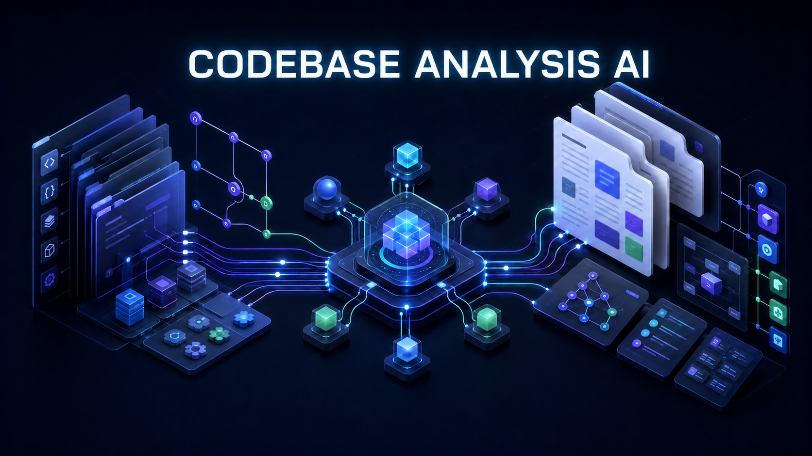
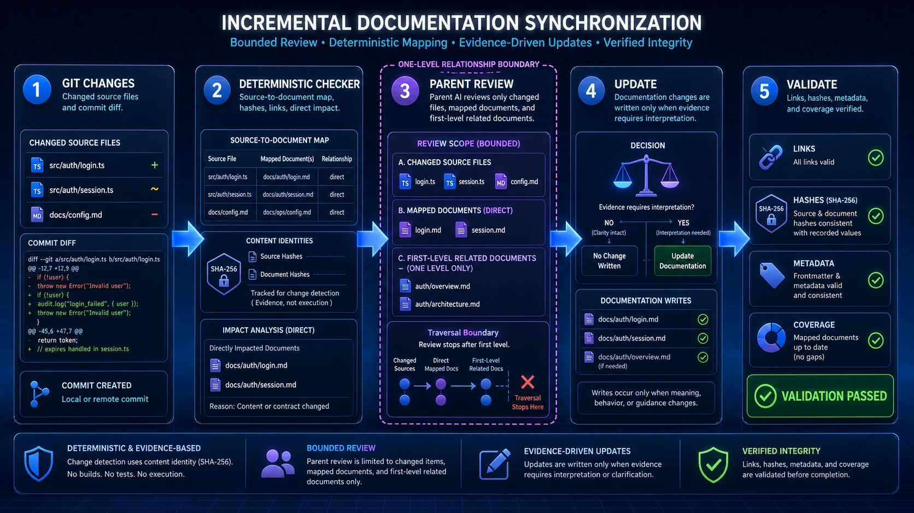
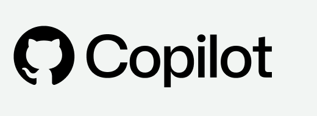
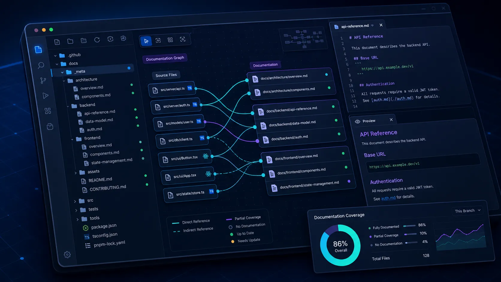

<h1 align="center">Codebase Analysis AI</h1>

<p align="center">
  Agentic AI codebase analysis for living documentation, architecture, and change-impact review.
</p>

<p align="center">
  
</p>

Are you tired of fragmented, inconsistent, unstructured, or even missing documentation?! Codebase Analysis AI keeps documentation aligned with the codebase through bounded, evidence-based analysis and repeatable checks.

It maps changed source files to the documentation they affect, reviews direct relationships, validates links and metadata, and asks an AI agent to update only what requires interpretation. Git, Python, Git hooks, and GitHub Actions provide the deterministic foundation; the agent skill handles the reasoning and writing.

The result is a documentation system that helps a new developer understand the project's purpose, technologies, startup instructions, architecture, active functionality, known TODOs, and related flows immediately after cloning the repository.

> A provider-neutral Agent Skill for keeping code and documentation aligned. The visual assets in this README are illustrative; the text and examples remain the source of truth.

## Why use it

Codebase Analysis AI reduces documentation drift by:

- starting from Git changes instead of scanning the complete repository;
- mapping source files to directly affected documents;
- checking links, hashes, metadata, naming, and documentation coverage;
- preserving a consistent documentation structure and evidence-backed TODOs;
- supporting monoliths, full-stack applications, microservices, libraries, mobile applications, and infrastructure repositories.

## How it works

1. Git identifies changed or uncommitted source files.
2. A deterministic Python checker resolves source-to-document mappings and direct first-level relationships.
3. The agent reviews the impacted sources and documentation.
4. The agent updates stale content only when the evidence requires it.
5. The checker validates links and refreshed metadata.

The traversal stops after one relationship level. If source `A` maps to document `B`, and `B` links to `C`, the update checks `B` and `C` without traversing the rest of the documentation graph. SHA-256 hashes track processed source content even when changes are uncommitted, amended, or rebased.



## Modes

| Mode | Purpose | Scope | Explicit request |
|---|---|---|---|
| `setup` | Install agent rules, checker, hooks, and GitHub Action | Configuration files | Yes |
| `bootstrap` | Create a complete documentation system | Full repository | Yes |
| `update` | Synchronize existing documentation | Changed files and direct relationships | No |
| `audit` | Review accuracy without changing files | Selected or impacted documentation | No |
| `migrate` | Index existing documentation and create metadata | Existing docs and mapped sources | Yes when restructuring is required |
| `check` | Run deterministic documentation-drift checks | Changed files, mappings, and direct relationships | No |

>`check` does not use an AI model. It is the command used by local hooks and CI to detect possible documentation drift.

### Existing documentation

For requests to create documentation from zero, the default `existingDocumentationPolicy: ask` prevents silent rebuilding:

- If any repository documentation exists, the preflight stops and the agent asks whether to use `migrate`, update/integrate the existing content, or explicitly replace it. It checks the first supported document path or canonical name only, without opening it; after the choice, the agent reads the other relevant documents.
- `migrate` rewrites existing files in place according to the selected style; `integrate` carries useful facts into a newly generated structure; `replace` deletes only the documentation files explicitly confirmed by the user before generating new files.
- If `docs/` exists without `docs/_meta/documentation-map.json`, the `migrate` choice indexes the existing documents and maps them to repository sources.
- `migrate` preserves useful project decisions and flows and requires confirmation before renaming, moving, deleting, or broadly restructuring documents.
- `update` changes only impacted documents and their first-level relationships, preserving manual sections and unrelated documents.

The documentation map identifies documents managed by Codebase Analysis AI through document IDs, source mappings, and source hashes. It does not prove that a document was originally created by the skill rather than adopted from an existing repository. Broad replacement or merging of existing documentation must therefore remain an explicit user decision.

After an update, the agent validates the changed documentation, refreshes hashes only for reviewed changed source paths, and reruns `check`.

## Agent compatibility

The core `SKILL.md`, references, scripts, and templates remain provider-neutral. Agent-specific files only define when to run the checker and when to invoke the skill.

| Agent | Skill location | Instruction file | Invocation |
|---|---|---|---|
| OpenAI Codex | `.agents/skills/codebase-analysis-ai/` | `AGENTS.md` | `$codebase-analysis-ai` |
| Claude Code | `.claude/skills/codebase-analysis-ai/` | `CLAUDE.md` | `/codebase-analysis-ai` |
| Gemini CLI | `.agents/skills/codebase-analysis-ai/` | `GEMINI.md` | Activate `codebase-analysis-ai` |
| GitHub Copilot | `.agents/skills/codebase-analysis-ai/` | `.github/copilot-instructions.md` | Ask Copilot to activate `codebase-analysis-ai` |

### Agent model targets

These marks identify example host targets only. They are navigation aids and do not imply endorsement or partnership.

<p align="center">
  &nbsp;&nbsp;&nbsp;
  &nbsp;&nbsp;&nbsp;
  &nbsp;&nbsp;&nbsp;
  
</p>

## Installation

Clone this repository and run the installer from the target project:

```bash
git clone https://github.com/MattiaF95/codebase-analysis-ai.git
python codebase-analysis-ai/install.py \
  --project-root /path/to/project \
  --agent all \
  --scope project \
  --with-agent-rules \
  --with-hooks \
  --with-github-action
```

Install only the skill for a project or for the current user:

```bash
python install.py --project-root /path/to/project --agent codex --scope project
python install.py --agent codex --scope user
```

The installer is idempotent, updates only managed files, and preserves unrelated instructions. Existing unknown hooks, workflows, or agent files are not replaced silently.

## Usage

Use explicit requests for operations that create or restructure documentation:

```text
Use codebase-analysis-ai in bootstrap mode and create the complete project documentation.
Use codebase-analysis-ai to update the documentation affected by the current Git changes.
Use codebase-analysis-ai to audit the existing documentation without modifying files.
Use codebase-analysis-ai setup to install agent rules, Git hooks, and the GitHub Action.
```

After installation, run the deterministic checker directly with:

```bash
python tools/codebase-analysis-ai/check.py check --mode working-tree
```

Before a full bootstrap, run the non-content preflight to detect existing text, markup, PDF, Office, OpenDocument, and other common documentation formats:

```bash
python tools/codebase-analysis-ai/check.py docs-state
```

## Automation

### Git hooks

Hooks provide fast local feedback for commits, pushes, merges, rebases, and amended commits. They run only the deterministic checker; they do not invoke an AI agent or rewrite documentation. They are installed under `.githooks/` and enabled with:

```bash
git config core.hooksPath .githooks
```

Hooks can be bypassed, so they are not the shared enforcement layer.

### GitHub Action

The workflow checks pull request updates, merge queues through `merge_group`, merges, direct pushes to the default branch, and manually requested audits. It uses `contents: read`, requires no model secrets, and creates no commits. Branch protection and required status checks must be enabled separately in repository settings.

## Documentation rules

The skill follows the repository's existing documentation-language policy. In `bootstrap`, `update`, `audit`, or `migrate`, if no reliable language evidence exists, it asks the user before continuing. The selected language is recorded in `docs/_meta/documentation-map.json`; technical identifiers, commands, API fields, and library names remain unchanged.

Topic documents normally follow this order:

1. Purpose and context
2. Responsibilities and behavior
3. Technologies and implementation details
4. Active functionality and planned work
5. Related documentation and sources

The skill never invents functionality, TODOs, commands, dependencies, or architectural relationships. Sensitive files, credentials, certificates, environment files, dependencies, and generated build directories are excluded from analysis.

## Generated documentation structure

The structure is adaptive: the skill detects repository shape, technologies, deployment boundaries, and existing terminology, then creates only useful areas. Empty standard folders are not added merely for symmetry.

```text
project/
├── README.md
├── docs/
│   ├── README.md
│   ├── architecture/
│   ├── backend/
│   ├── frontend/
│   ├── database/
│   ├── infrastructure/
│   └── _meta/
└── tools/codebase-analysis-ai/
```

Mobile applications, infrastructure repositories, libraries, command-line tools, and other repository types receive a taxonomy appropriate to their evidence.



The diagrams are illustrative. Actual generated paths and responsibilities depend on the detected repository shape.

## Development and validation

The installable skill lives under `skill/codebase-analysis-ai/`; the separate Python test suite under `tests/` is not copied into target projects.

```bash
python3 -m unittest discover -s tests -p "test_*.py"
```

The tests verify mappings, one-level impact resolution, link validation, installer idempotency, language metadata, stale-source detection, and hash refreshes. They do not judge whether AI-generated prose is clear or technically complete, and they do not verify live GitHub branch protection.

## Repository structure

```text
codebase-analysis-ai/
├── README.md
├── assets/                            README illustrations and agent logos
├── LICENSE                            Apache License 2.0
├── install.py                         Cross-agent installer
├── skill/codebase-analysis-ai/
│   ├── SKILL.md                       Mode router and safety boundaries
│   ├── agents/openai.yaml             Optional Codex UI metadata
│   ├── references/                    Mode-specific instructions
│   ├── scripts/                       Deterministic analysis and installation code
│   └── assets/                        Hooks, workflows, adapters, and templates
└── tests/                             Unit, integration, and fixture tests
```

## Author

Created by [MattiaF95](https://github.com/MattiaF95).

## License

Licensed under the [Apache License 2.0](LICENSE).
